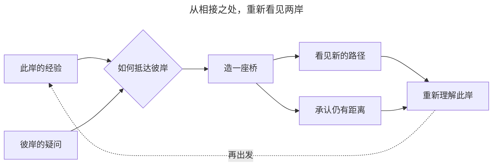
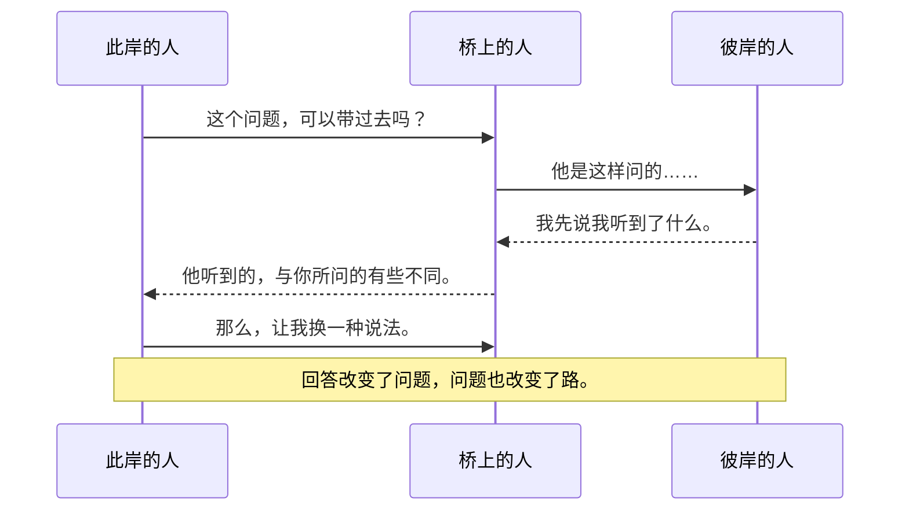
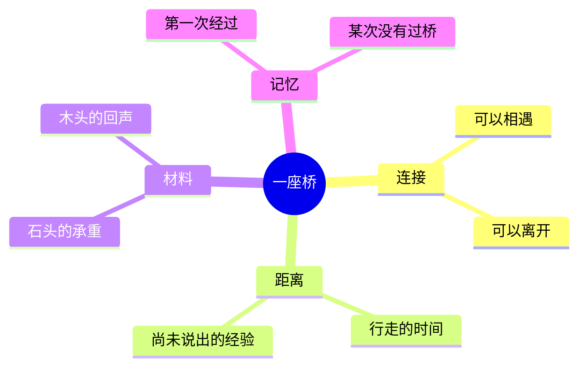
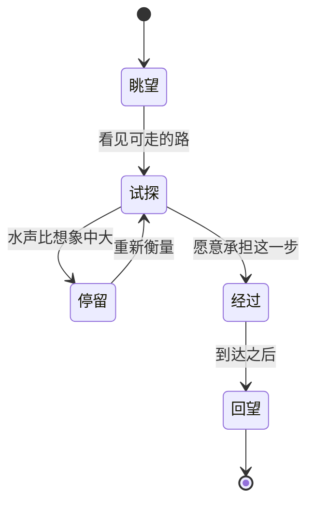
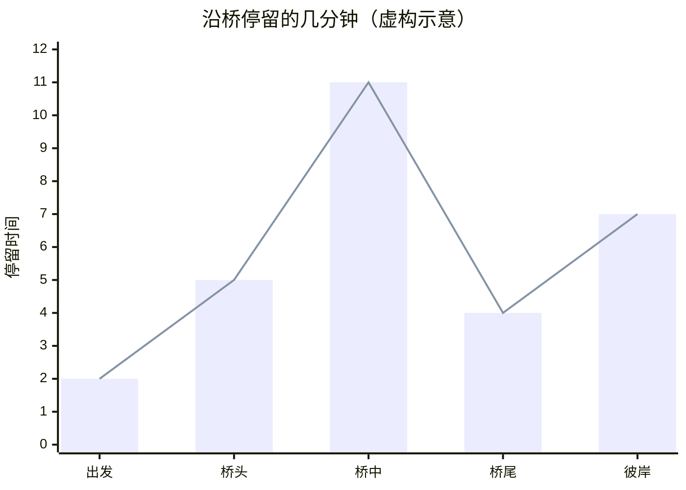

# 一座桥，几种走法

**图解与旁注 · 朱墨原创示例**

一座桥把两岸接在一起，也让我们重新理解了“两岸”这个说法。图解不是把论述画成捷径。它让原来藏在句子里的连接显出形状，也提醒我们：每一条箭头都欠着一个解释。[^箭头]



## 相遇有它的次序

桥已经在了，并不意味着理解已经发生。一个问题抵达另一个人，要经过等待、重述和某次恰好发生的回望。[^等待]



## 中心并不占有一切

一张图总要在某处开始。这个起点只是我们暂时安放目光的位置；从另一侧走来，同一座桥会先呈现出完全不同的事物。



## 从犹疑到行动

“决定”并不总是某个瞬间的光亮。它也可能是犹疑中一连串微小变化的名字。看清变化的条件，常常比给最终状态取名更有帮助。



## 比例也是一种叙述

如果把过桥的人数画出来，桥就显得像一种流量设施。但没有过桥的人、走到一半回去的人，以及只是站着听水的人，都可能不在那组数字里。



[^箭头]: 这里的箭头表示阅读时提出的联系，不自动表示因果或必然推出。如果要论证“造桥改变了此岸”，还需要说清楚改变了谁的行动、哪些生活条件，以及这个变化持续了多久。[^条件]

    ```mermaid
    flowchart TB
      A[发现一个联系] --> B[说明箭头的含义]
      B --> C{理由够充分吗}
      C -->|还不够| D[保留问题]
      C -->|在这些条件下| E[提出有限的判断]
    ```

[^条件]: 一个关系图可以把条件放进节点里，却不能代替对条件的检验。图越简洁，越需要回到那些被省略的句子。

    ```mermaid
    flowchart LR
      A[图中的结构] -. 回到 .-> B[具体的经验]
      B -. 修订 .-> A
    ```

    对于一段长度为 $s$ 的路，$t=s/v$ 只在速度恒定等假定下成立。公式和图解都需要交代自己的适用范围。[^范围]

[^范围]: “适用范围”也不是一次写完的附录。新经验可能要求我们重画箭头，或承认某个问题仍留在图外。

[^等待]: 等待改变了对话的节奏。时序图里两条消息之间的空白，不能直接换算成真实的等待时长；它首先表示前后关系。
