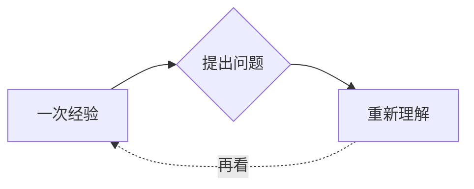

# 图解，也可以细读

朱墨 2.0 的正文、常驻旁注、就地注页、注释脉络、全书长卷，以及源文编辑和注释写作台的排版预览，都可以呈现 Mermaid 图解。

图解沿用当前阅读主题。琉璃以透光边界和浅色折光衬托结构，星辰以深色画布和细星点保留距离；另外六套主题也有对应的图形与文字配色。实际图形来自文稿中的节点、连线与标签。

## 放近，或回到全貌

点击图形或「展开图解」，进入独立的细读面板。图形获得键盘焦点后，按 Enter 或空格也可展开。

- 「适合图解」显示完整结构；「实际大小」回到 100%。可用滑杆、加减按钮，或 `+` / `−` 调整大小，手动缩放范围为 1%–800%；极长的图在适合模式下可以进一步缩小。
- 按住空格拖动，或直接使用横向、纵向滚动。`Ctrl` 配合滚轮围绕指针所在位置缩放；`F` 回到完整结构，`0` 回到实际大小。
- 右下角的小全览标示目前看到的范围，点击其中的位置可以抵达图中对应部分。键盘聚焦全览后按 Enter，回到图形中心。
- 「源文」展开这张图的 Mermaid 文本；「复制源文」与「复制 SVG」分别复制原始图解描述和当前配色的矢量图。包含公式的 SVG 保留 MathML，适合在支持它的浏览器中查看；其他图形软件的支持情况可能不同。
- 按 Esc 或关闭按钮回到原来的阅读位置与按钮。面板可以叠放在注页、脉络与长卷之上，关闭后继续原先的阅读。

正文中的图解占用稳定的阅读高度，完整大图在细读面板中展开。正文、旁注与全文搜索均保留图解源文；搜索命中图中标签时，落到图形所在处。修改图解仍需明确开启编辑。

## 写进 Markdown

使用标为 `mermaid` 的代码围栏。普通代码围栏和被其他代码围栏包住的 Markdown 示例保持代码原样。

````markdown

````

注释中的围栏和每一行内容均缩进四个半角空格；子注定义仍独立放在顶层。

````markdown
这个联系需要解释。[^关系]

[^关系]: 箭头的含义也需要交代，不能把相邻直接当作因果。

    ```mermaid
    flowchart TB
      A[看见联系] --> B[说明理由]
      B --> C[限定判断]
    ```
````

目前实机检查了流程图、时序图、思维导图、状态图、类图、实体关系图、时间线和坐标图，以及流程图、时序图中的公式标签。图中的公式使用 Mermaid 的 `$$…$$` 写法；它们由 Mermaid 自己的数学标签处理，与正文的公式编号和宏作用域独立。

图解在本机按可见位置依次排版，同一图形的不同阅读入口各有独立的 SVG 标识。源文始终保留；遇到错误或不能排版的语法，会显示源文，并可展开查看原因。图解中的外部图像和交互脚本不执行或加载，文稿不能借图解配置更改应用主题。静谧及减少动态效果模式会关闭图解的动画。

[原创范例：一座桥，几种走法](diagram-reading-example.md) 将图解放进实际论述和三层注释中。是否采用图解应由表达需要决定，不要求每篇文章或每条注释都画图。

实现采用本机打包的 Mermaid 11.17.2。语法参考：[Mermaid 图解文档](https://mermaid.js.org/intro/)、[图中公式](https://mermaid.js.org/config/math.html)、[坐标图](https://mermaid.js.org/syntax/xyChart.html)。
